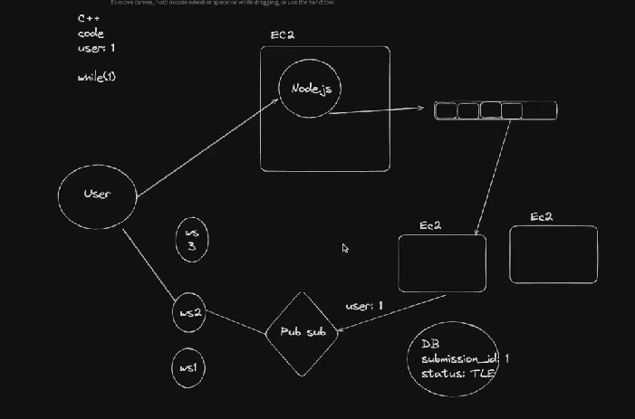
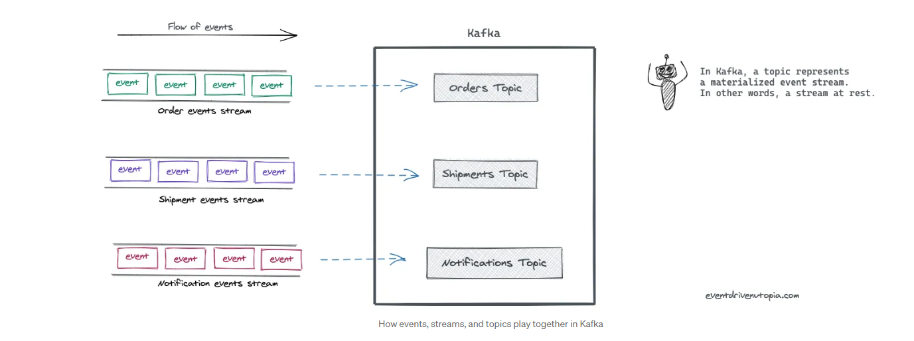
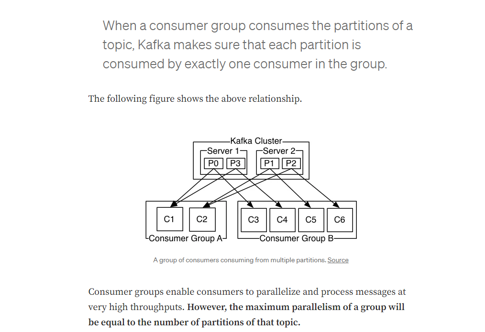

# Advanced BackEnd Communication

Req/Res 
Pros
Elegant and Sinple
Stateless 
Scaleable

Cons
Bad for muktple sevrs
High Couling
Cahing, Cicnbut Breaking

## Redis

- Redis is an in-memory data structure store.
- It's commonly used as a message broker and caching solution.
- Enables fast read and write operations.
- Can persist dataset by storing it on disk for durability.

### How it Persists Data (Helps in Recovery too)

- Redis offers two main persistence options:
  - AOF (Append-Only File):
    - Logs every write operation received by the server.
    - Appends each operation to a file.
    - This log can be replayed during startup to reconstruct the dataset.
  - RDB (Redis DataBase):
    - Performs point-in-time snapshots of the dataset at specific intervals.
    - Creates a compact single-file representation of the entire Redis dataset.
    - This file can be used to restore the dataset in case of failure or restart.

---

## Message Queues

- **Asynchronous Communication**: Enables producers to send messages to a queue without immediate processing, enhancing system resilience.
- **Message Persistence**: Messages are stored until consumed, ensuring reliable delivery even during failures.
- **Load Leveling**: Balances system load by buffering requests during peak periods and throttling consumption during low traffic.
- **Guaranteed Delivery**: Provides features like acknowledgments and retries for reliable message delivery.
- **Message Ordering**: Some queues maintain message order to ensure sequential processing.
- **Use Cases**: Commonly used for task distribution, event-driven architectures, job scheduling, and reliable communication in distributed systems.
- **Example**: Leetcode's Submission Evaluation
  - Leetcode evaluates user submissions using a separate evaluation service or worker nodes.
  - Instead of processing submissions directly on its primary backend, Leetcode delegates this task to evaluation workers.
  - When a user submits a solution, Leetcode pushes the evaluation task to a message queue.
  - Evaluation workers pick up tasks from the queue when they are ready to process them.
  - This asynchronous processing allows Leetcode to handle evaluation tasks efficiently without impacting the responsiveness of its primary backend.

---

## Pub-Subs

- **Publish-Subscribe Model**: Publishers send messages to topics without knowledge of subscribers, who express interest in specific topics.
- **Loose Coupling**: Promotes independence between publishers and subscribers, enabling scalability and flexibility.
- **Scalability**: Handles large numbers of publishers and subscribers efficiently.
- **Real-Time Communication**: Well-suited for broadcasting updates and coordinating events in distributed systems.
- **Event-Driven Architecture**: Key component for reacting to events and messages independently.
- **Use Cases**: Widely used in real-time analytics, chat applications, IoT platforms, and distributed system architectures.
- **Example**: 2-Player Chess Game
  - Consider a 2-player online chess game with potential high traffic and the need for server scaling.
  - In a particular game, each player may be connected to different servers for load balancing purposes.
  - When one player makes a move, their server needs to notify the opponent's server about the move.
  - Without knowing the recipient server in advance, the player's server publishes the game event (e.g., game ID) to a pub-sub model.
  - The pub-sub model determines which server is subscribed to that game ID and immediately notifies it about the move.
  - The recipient server then notifies the opponent about the move, ensuring real-time gameplay without server-specific dependencies.
  **Pros**
  - Scales between muliple services
  - Great for Microservices
  - Loose Coulping
  **Cons**
  - Message delivery issue
  - Compexity

---

## Stateless vs Stateful Backend

### Stateful Backends

- Cache or store data in memory.
- Maintain state as per application requirements.
- Not completely reliant on databases.
- Stickiness is required to ensure users remain connected to the same server throughout their session.
- Stickiness is often maintained by routers or load balancers through health checks and server assignments.

### Stateless Backend

- Do not store data in memory.
- Do not require sticky sessions.
- Users belonging to the same group or session may be connected to different servers.
- Rely on message brokers like message queues and pub-sub models like Redis or Kafka for inter-server communication.

## Kafka

### Kafka Overview

Kafka is a distributed streaming platform designed for real-time data processing. It provides a pub-sub messaging model where producers publish messages to topics, and consumers subscribe to topics to receive messages.

### Key Components

- **Brokers:** Kafka cluster nodes responsible for storing and managing partitions.
- **Topics:** Logical channels for publishing and subscribing to messages.
- **Partitions:** Segments of topics that enable parallel processing and data distribution.
- **Producers:** Applications that publish messages to Kafka topics.
- **Consumers:** Applications that subscribe to topics and consume messages.
- **Consumer Groups:** Groups of consumers that work together to consume messages from topics.
- **ZooKeeper:** Coordination service used for managing Kafka cluster metadata and leader election.

### High Throughput and Low Latency

- Kafka is optimized for high throughput and low latency, making it suitable for real-time data processing and event-driven architectures.
- It achieves high throughput by efficiently batching and compressing messages, minimizing network overhead, and leveraging disk-based storage for sequential writes.
- Kafka's design prioritizes low-latency message delivery, enabling near-real-time data processing and stream processing applications.

### Scalability and Fault Tolerance

- Kafka is horizontally scalable, allowing clusters to handle large volumes of data and high throughput.
- Partitions are distributed across multiple brokers for scalability.
- Replication of partitions ensures fault tolerance and data durability.

### Message Distribution

- Producers write messages to partitions using partitioning strategies like round-robin or key-based partitioning.
- Messages within partitions are ordered, but across partitions, order is not guaranteed.
- Consumers fetch messages from partitions using pull-based mechanisms and maintain their own offsets.
- Kafka employs consumer groups to ensure each partition is consumed by exactly one consumer in the same group.
- The number of partitions determines the maximum parallelism of a topic, not the number of consumers.

## Usage Scenarios of Adding Consumers in Same Group vs. Different Group

## Same Consumer Group

- **Purpose**: Increase consumption rate or achieve higher throughput for a specific topic.
- **Mechanism**: Each consumer in the group consumes from a different partition.
- **Benefits**:
  - Parallel message processing.
  - Faster consumption.

## Different Consumer Groups

- **Purpose**: Allow multiple consumers from the different groups to consume the same partition.
- **Mechanism**: Each consumer group has its own set of consumers.
- **Benefits**:
  - Independent message consumption.
  - Flexibility for different processing needs.
